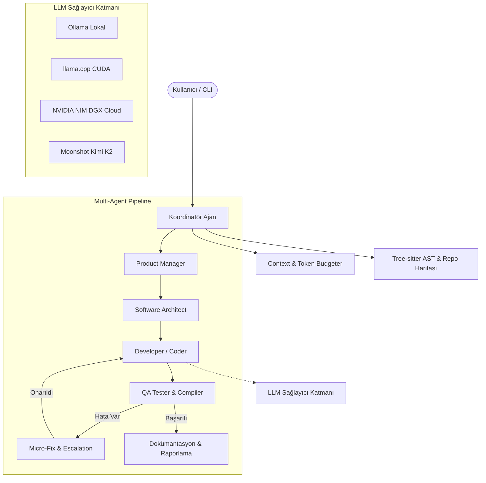

# 🤖 MYF AI Agent CLI

> **Otonom, Çok Katmanlı Multi-Agent Yazılım Mühendisliği ve Kodlama Konsolu**  
> Claude Code, Google Antigravity ve Devin mimarilerinden ilham alınarak geliştirilmiş; yerel (Ollama, llama.cpp, LM Studio) ve bulut (NVIDIA NIM, Moonshot, OpenRouter) LLM sağlayıcılarını destekleyen yeni nesil otonom ajan motoru.

[](https://www.python.org/)
[](LICENSE)
[](https://ollama.com)
[](https://build.nvidia.com)

---

## 🌟 Öne Çıkan Özellikler

### 1. 🧠 Multi-Agent Orkestrasyonu & Otonom Pipeline
- **Koordinatör Ajan (Coordinator):** Görevi analiz eder, adımları planlar ve alt uzman ajanları yönetir.
- **Product Manager:** Gereksinim analizi, user-story ve PRD dokümantasyonu hazırlar.
- **Software Architect:** Proje mimarisini, dizin ağacını ve API sözleşmelerini tasarlar.
- **Developer (Coder):** Temiz, modüler, tip güvenli kod üretir ve dosya sistemine yazar.
- **QA Tester & Micro-Fix:** Üretilen kodları fiziksel olarak derler, test eder ve derleme/syntax hatalarını tespit eder.
- **Micro-Fix & Self-Correction:** Hata alan kodları otomatik olarak tespit edip onarır (maksimum 3 döngü). Çözülemezse büyük modele eskalasyon uygular.

### 2. ⚡ Kesintisiz Devam & Bağlam Yönetimi (Claude / Antigravity Style)
- **Gerçek Token Sınırı Tespiti:** Model yanıtı token veya context limitine ulaşıp yarıda kesildiğinde (`finish_reason === "length"` veya kapanmamış kod bloğu) anında tespit edilir.
- **Seamless Continuation:** Yarıda kalan kod veya açıklama baştan başlamaz; tam olarak kesildiği son karakterden devam eder.
- **Proaktif Context Budgeter:** Sohbet geçmişi ve sistem promptu dinamik olarak token bütçesine göre yönetilir.

### 3. 🔍 RepoMap & Derin Kod Tabanı Algısı
- **Tree-sitter AST Analizi:** Kod tabanındaki fonksiyon, sınıf, interface ve import bağımlılıklarını ayrıştırır.
- **PageRank Grafı:** En kritik modülleri belirler ve prompt bütçesine sığdırılmış Repo Haritası enjekte eder.

### 4. 🌐 Canlı Web Araştırması (Agent-Reach)
- DuckDuckGo / SearXNG üzerinden canlı web araması yaparak güncel dokümantasyon ve kütüphane sürümlerini çeker.

---

## 🏗 Mimari Şema



---

## 🚀 Hızlı Başlangıç

### 1. Gereksinimler
- Python 3.10 veya üzeri
- (Opsiyonel) Lokal LLM için [Ollama](https://ollama.com) veya [llama.cpp](https://github.com/ggerganov/llama.cpp)

### 2. Kurulum

```bash
# Repoyu klonlayın
git clone https://github.com/bymayfe/myf-agent-cli.git
cd myf-agent-cli

# Sanal ortam oluşturun ve aktif edin
python3 -m venv .venv
source .venv/bin/activate  # Windows için: .venv\Scripts\activate

# Bağımlılıkları yükleyin
pip install -r requirements.txt

# Çevre değişkenlerini yapılandırın
cp .env.example .env
```

### 3. Çalıştırma

```bash
# 1. İnteraktif Sohbet Konsolu (REPL)
python main.py

# 2. Otonom 5-Aşamalı Multi-Agent Pipeline Modu
python main.py pipeline "Next.js 16 ile modern bir Todo uygulaması geliştir"
```

---

## ⌨️ İnteraktif Konsol Komutları

| Komut | Açıklama |
| :--- | :--- |
| `/think on\|off` | Modelin içsel düşünme (`<think>`) sürecini açar/kapatır |
| `/settings` | İnteraktif model ve sıcaklık ayarları menüsünü açar |
| `/compact` | Sohbet geçmişini özetleyerek bağlam hafızasını boşaltır |
| `/undo` | Son yapılan dosya veya mesaj adımını geri alır |
| `/name <isim>` | Koordinatörün adını anında değiştirir |
| `/help` | Tüm kullanılabilir komutları listeler |

---

## 📄 Lisans

Bu proje **MIT** lisansı altında yayınlanmıştır. Detaylar için [LICENSE](LICENSE) dosyasına bakabilirsiniz.
